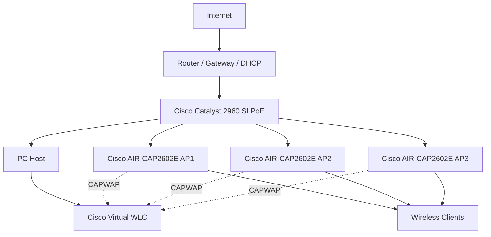

# ISEP Career Summit — Temporary Wireless Infrastructure

Temporary Cisco wireless infrastructure deployed for the **ISEP Career Summit**, using a Cisco Catalyst PoE switch, three Cisco Aironet lightweight access points and a Cisco Virtual Wireless LAN Controller.

The project focused on practical deployment, Layer 2 switching, PoE, CAPWAP/WLC operation and troubleshooting of legacy Cisco wireless equipment.

## Architecture



## Infrastructure

| Role | Platform |
|---|---|
| Access switching / PoE | Cisco Catalyst 2960 SI PoE |
| Wireless access | 3 × Cisco AIR-CAP2602E-E-K9 |
| Wireless controller | Cisco Virtual Wireless Controller |
| Gateway / DHCP / Internet | Router supplied for the event |
| WLC host | PC running the virtual controller |

The switch operated purely at **Layer 2**. Gateway, DHCP and Internet access remained on the upstream router.

## Network Design

The final design intentionally remained simple:

- one operational VLAN for the event;
- one blackhole VLAN for unused switchports;
- access-mode ports for APs, WLC host and uplink;
- unused ports administratively shut down;
- APs powered through PoE;
- lightweight APs centrally controlled by the WLC;
- DHCP provided by the upstream router.

Planned reserved addressing placed infrastructure devices at the upper end of the subnet:

| Device | Reserved host address |
|---|---:|
| Switch management | `.251` |
| WLC host | `.252` |
| Virtual WLC | `.253` |
| Gateway | `.254` |

The client DHCP pool remained below these reservations.

## Technical Highlights

- Cisco Catalyst Layer 2 switching and PoE
- VLAN-based port separation
- unused-port shutdown and blackhole VLAN
- PortFast and BPDU Guard on edge ports
- Cisco lightweight APs
- CAPWAP controller discovery and association
- virtual WLC deployment
- centralized SSID configuration
- WPA2-PSK
- DHCP-based client addressing
- CDP, MAC-table and PoE validation
- troubleshooting of CAPWAP/DTLS certificate failure

## Troubleshooting Highlight

The most relevant issue occurred after Layer 3 connectivity had already been verified:

```text
AP -> WLC ping       OK
CAPWAP communication OK
AP join              FAILED
```

The AP logs showed a DTLS certificate error. Investigation identified expired MIC certificates on the older Aironet APs. The WLC was configured to ignore MIC certificate expiry for these devices, allowing the APs to progress through the join process.

This was an important distinction during troubleshooting: **successful IP connectivity did not imply successful CAPWAP association**.

See [Troubleshooting](docs/troubleshooting.md).

## Validation

Deployment checks included:

- switch interface status;
- VLAN membership;
- PoE status;
- MAC address table;
- CDP neighbors;
- AP management addressing;
- AP-to-WLC reachability;
- CAPWAP client state;
- WLC AP/client status;
- Internet connectivity.

Observed PoE usage was approximately **15.4 W per AP**, or **46.2 W total** for the three APs.

See [Validation](docs/validation.md).

## Documentation

- [Architecture](docs/architecture.md)
- [Switching](docs/switching.md)
- [WLC and Access Points](docs/wlc-and-access-points.md)
- [Troubleshooting](docs/troubleshooting.md)
- [Validation](docs/validation.md)
- [Lessons Learned](docs/lessons-learned.md)
- [Topology Diagram](diagrams/topology.md)

## Scope

This repository documents the design, deployment and troubleshooting of a temporary event network. It is not intended as a reusable production deployment template.
