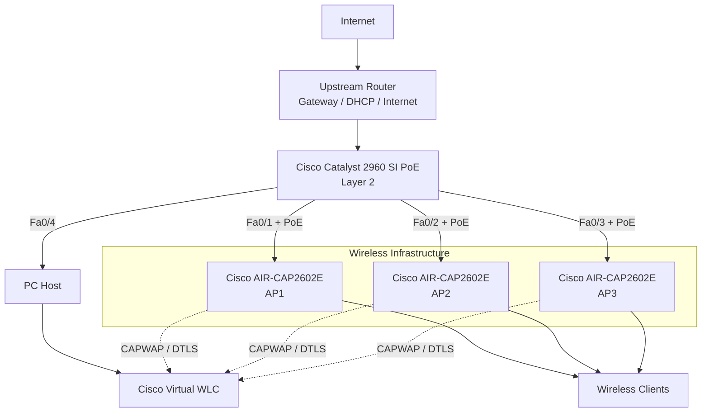
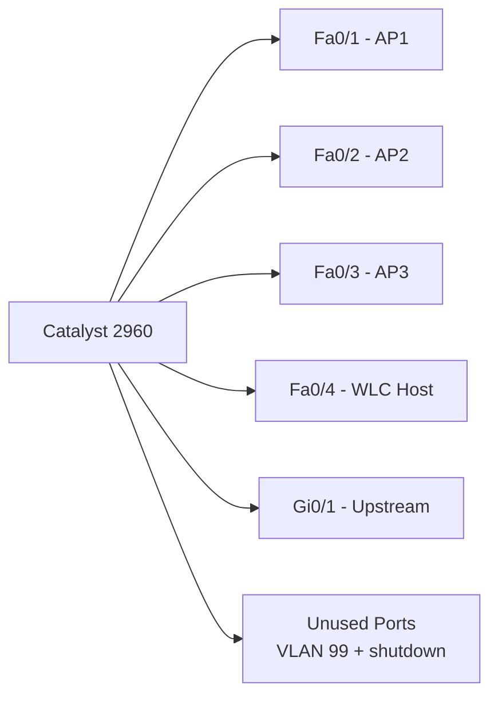

# Topology



## Switching View



## Addressing Concept

```text
Client DHCP pool
        |
        | dynamic client addressing
        v

upper addresses reserved for infrastructure:

.251  switch management
.252  WLC host
.253  virtual WLC
.254  gateway
```
