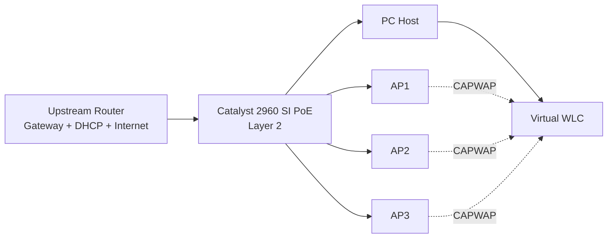

# Architecture

## Objective

The infrastructure was built as a temporary wireless network for the ISEP Career Summit.

The design prioritized:

- fast deployment;
- minimal dependency on the existing network;
- centralized AP management;
- simple Layer 2 topology;
- predictable infrastructure addressing;
- basic switch hardening.

## Logical Design



## Device Roles

### Upstream Router

Responsible for:

- default gateway;
- DHCP;
- Internet access;
- infrastructure address reservations.

### Catalyst 2960

Used as a Layer 2 access switch:

- connectivity between router, APs and WLC host;
- PoE for the three APs;
- operational VLAN;
- blackhole VLAN for unused ports;
- management SVI;
- basic edge-port protection.

### Virtual WLC

Responsible for:

- AP control;
- CAPWAP association;
- SSID configuration;
- wireless security;
- radio management;
- client visibility.

### Aironet Access Points

The AIR-CAP2602E APs used a lightweight image and therefore depended on the WLC for operational configuration.

## Addressing Model

The final plan reserved the upper addresses of the subnet for infrastructure:

```text
.251  switch management
.252  WLC host
.253  virtual WLC
.254  gateway
```

Wireless clients received addressing from the upstream router.

## Design Boundary

The final event design deliberately avoided unnecessary complexity:

- no routing on the Catalyst 2960;
- no multi-VLAN wireless design;
- no trunk between WLC and switch;
- no autonomous AP configuration.

The WLC management interface remained untagged because its switchport was configured as an access port.
